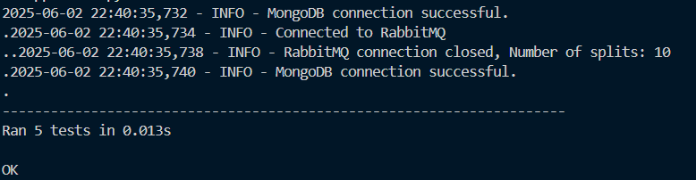
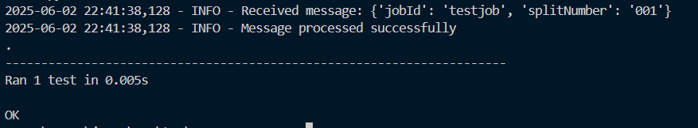
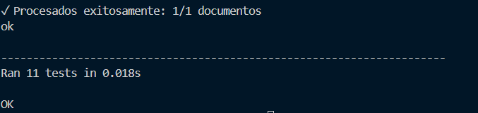

# BioRxiv Search

## Proyecto 2 - Bases de Datos II (IC4302)

### Instituto Tecnológico de Costa Rica

#### Semestre I, 2025

---

## Integrantes

- Erick Abarca Calderón - 2022296303

**Profesor:** Gerardo Nereo Campos Araya

**Fecha de Entrega:** 30/05/2025

---

## Tabla de Contenidos

1. [Descripción del Proyecto](#descripción-del-proyecto)
2. [Requisitos de Ejecución](#requisitos-de-ejecución)
3. [Instrucciones de Ejecución](#instrucciones-de-ejecución)
   - [Configuración del Ambiente](#configuración-del-ambiente)
   - [Construcción de Imágenes Docker](#construcción-de-imágenes-docker)
4. [Arquitectura del Sistema](#arquitectura-del-sistema)
5. [Componentes](#componentes)
   - [Controller](#controller)
   - [Api Crawler](#api-crawler)
   - [SEE](#see)
   - [Sparkjob](#sparkjob)
6. [Pruebas Unitarias](#pruebas-unitarias)
   - [Resultados del Controller](#resultados-del-controller)
   - [Resultados del Api Crawler](#resultados-del-api-crawler)
   - [Resultados del SEE](#resultados-del-see)
   - [Resultados del Sparkjob](#resultados-del-sparkjob)
7. [Conclusiones y Recomendaciones](#conclusiones-y-recomendaciones)
   - [Conclusiones](#conclusiones)
   - [Recomendaciones](#recomendaciones)
8. [Referencias Bibliográficas](#referencias-bibliográficas)

## Descripción del Proyecto

bioRxiv Search V2 es una solución distribuida para la recolección, procesamiento y búsqueda de artículos científicos relacionados con COVID-19. Esta aplicación emplea múltiples tecnologías como Mongo Atlas Search, Apache Spark, Spacy, RabbitMQ y Kubernetes para ofrecer una plataforma robusta y escalable basada en microservicios.

El proyecto permite a los usuarios ingresar consultas en lenguaje natural y navegar entre artículos científicos enriquecidos mediante extracción de entidades. La búsqueda se realiza a través de un índice definido en Mongo Atlas Search con soporte de facets y highlighting, todo desplegado sobre Kubernetes y automatizado con Helm Charts.

## Requisitos de Ejecución

Para correr el proyecto correctamente, asegúrate de contar con las siguientes herramientas y servicios instalados y configurados:

- Docker Desktop con soporte para Kubernetes habilitado
- Helm versión 3.x
- kubectl para gestionar el clúster de Kubernetes
- Node.js versión 18 o superior
- Python versión 3.10 o superior
- LENS (Kubernetes IDE)
- MongoDB Atlas (base de datos en la nube)
- Firebase / Firestore configurado para autenticación y manejo de datos
- Vercel para el despliegue de la interfaz de usuario (UI)
- Cuenta activa en GitHub
- Editor de código Visual Studio Code

### Configuración del Ambiente

Antes de ejecutar el proyecto, sigue estos pasos:

1. **Instalar Docker Desktop**: Asegúrate de que Docker Desktop esté instalado y configurado para usar Kubernetes.
2. **Instalar Helm**: Descarga e instala Helm 3.x desde su [sitio oficial](https://helm.sh/docs/intro/install/).
3. **Instalar kubectl**: Asegúrate de tener `kubectl` instalado y configurado para interactuar con tu clúster de Kubernetes.
4. **Instalar Node.js y Python**: Asegúrate de tener Node.js 18+ y Python 3.10+ instalados en tu sistema.
5. **Instalar LENS**: Descarga e instala LENS desde su [sitio oficial](https://k8slens.dev/).

### Clonar el repositorio

Abre tu terminal y ejecuta:

```bash
git clone https://github.com/ErickAbarca/2025-01-IC4302/tree/main
cd ZP2
```

### Construcción de Imágenes Docker

Para facilitar la construcción de las imágenes Docker necesarias, se incluyen los scripts:

- build.bat
- install.bat

Ejecuta estos scripts en el orden indicado para construir y desplegar los contenedores correctamente.

## Instrucciones de Ejecución

1. Accede a la aplicación en producción a través del siguiente enlace: https://react-tau-ruby.vercel.app/
2. Para interactuar con servicios específicos o depurar componentes, utiliza LENS para explorar y gestionar el clúster Kubernetes localmente.

## Arquitectura del Sistema

La arquitectura del sistema se basa en un enfoque de microservicios, donde cada componente cumple una función específica y se comunica a través de RabbitMQ. El sistema está diseñado para ser escalable y distribuido, utilizando Kubernetes para la orquestación de contenedores y Mongo Atlas Search para la búsqueda eficiente de artículos científicos.
La arquitectura incluye los siguientes componentes principales:

- **Controller**: Punto de entrada para las solicitudes del usuario.
- **Api Crawler**: Recolecta artículos científicos desde bioRxiv.
- **SEE (Servicio de Extracción de Entidades)**: Procesa los artículos científicos y extrae entidades relevantes.
- **Sparkjob**: Procesa grandes volúmenes de datos científicos utilizando PySparkSQL.
- **UI**: Interfaz de usuario para interactuar con el sistema, desplegada en Vercel.

## Componentes

### Controller

El Controller es el punto de entrada para las solicitudes del usuario. Se encarga de recibir las consultas en lenguaje natural, procesarlas y enviar las respuestas adecuadas. Utiliza Mongo Atlas Search para realizar búsquedas eficientes y devolver resultados enriquecidos.

### Api Crawler

El Api Crawler es responsable de recolectar artículos científicos desde bioRxiv. Utiliza técnicas de scraping y APIs para obtener los datos necesarios, que luego son almacenados en MongoDB. Este componente se ejecuta periódicamente mediante un CronJob en Kubernetes.

### SEE

El SEE (Servicio de Extracción de Entidades) utiliza Spacy para procesar los artículos científicos y extraer entidades relevantes. Este componente se encarga de enriquecer los datos almacenados en MongoDB, facilitando una búsqueda más precisa y contextualizada.

### Sparkjob

El Sparkjob se encarga de procesar grandes volúmenes de datos científicos utilizando PySparkSQL. Este componente permite realizar análisis complejos y generar insights a partir de los artículos recolectados, optimizando el rendimiento y la escalabilidad del sistema.

### UI

La interfaz de usuario (UI), desplegada en Vercel, ofrece una experiencia fluida e intuitiva para interactuar con el sistema. Los usuarios pueden ingresar consultas en lenguaje natural, explorar artículos científicos y visualizar resultados.

Para su desarrollo, usamos herramientas de inteligencia artificial que, basándose en la estructura de nuestro servidor y las rutas definidas, género el código funcional de la UI desde el primer intento, agilizando significativamente el proceso de implementación.

Para más detalles técnicos y ejemplos, se puede consultar la referencia 1.

### API con Node.js

La API requiere una clave de acceso (API Key) de 16 caracteres para autorizar las consultas realizadas desde Firebase y garantizar la seguridad del sistema. Esta clave controla el acceso a la API, que recibe las consultas de los usuarios, las procesa y devuelve resultados precisos de búsqueda. Sin esta API Key válida, las peticiones son bloqueadas con un error 403 para proteger la aplicación.

Para una descripción más detallada sobre la implementación y seguridad de la API, se recomienda revisar las referencias 4 y 8.

## Pruebas Unitarias

### Resultados del Controller

- test_connMongo_success

Verifica que la función connMongo:

   1. Establece correctamente una conexión con MongoDB.
   2. Realiza el comando ping para confirmar que la base de datos está activa.
   3. Usa un mock de MongoClient para evitar conexión real.

- test_dataBio_success

Simula una respuesta HTTP exitosa y verifica que:

   1. dataBio retorne un diccionario con la clave "messages".
   2. El valor esperado dentro del mensaje (total = 100) esté presente.
   3. Prueba el flujo normal de obtención de datos desde la API.

- test_retrieveData_returns_docs

Simula una conexión a MongoDB y verifica que:

   1. retrieveData retorne una lista de documentos.
   2. Se extraiga correctamente un jobId del documento.
   3. Evalúa la correcta lectura desde la base de datos.

- test_connect_to_rabbitmq_success

Verifica que la función connect_to_rabbitmq:

   1. Establezca una conexión con RabbitMQ.
   2. Cree el canal y declare la cola.
   3. Usa mocks para evitar conexión real a RabbitMQ.

- test_main_generates_messages

Verifica que la función main:

   1. Recupere correctamente los documentos.
   2. Genere la cantidad esperada de mensajes (uno por página).
   3. Llame a messageRabbitmq la cantidad adecuada de veces.
   4. Cierre correctamente la conexión y el canal al finalizar.
   5. Esta prueba integra y simula todo el flujo del sistema principal.

Resultado: 

### Resultados del api Crawler

- test_save_data_creates_file

Verifica que la función saveData:

   1. Cree el directorio de salida si no existe.
   2. Cree un archivo con el nombre correcto (jobId_splitNumber.json).
   3. Escriba los datos en el archivo.
   4. Usa mock_open y patch para simular el sistema de archivos.

- test_data_bio_success

Simula una respuesta exitosa de una petición HTTP (status_code 200) y verifica que:

   1. dataBio retorne un diccionario con la clave "collection".
   2. Prueba el flujo esperado cuando la API devuelve datos correctamente.

- test_data_bio_failure

Simula una respuesta fallida (status_code 404) y verifica que:

   1. dataBio retorne None ante un fallo en la petición.
   2. Evalúa el comportamiento frente a errores de red o URLs inválidas.

- test_connect_to_rabbitmq_success

Simula una conexión exitosa a RabbitMQ y verifica que:

   1. La función connect_to_rabbitmq devuelva una conexión y canal válidos.
   2. Utiliza mocks para evitar conexión real a RabbitMQ.

- test_message_rabbitmq_success

Verifica que messageRabbitmq no lance excepciones al enviar un mensaje a una cola con un canal simulado.

   1. Asegura que el envío básico de mensajes funciona correctamente.

### Resultados del SEE

- test_handle_message_success

Simula todo el flujo interno de la función handleMessage y verifica que:

   1. Se cargue el modelo de Spacy.
   2. Se lean correctamente los datos del disco.
   3. Se extraigan autores, fecha y entidades con las funciones correspondientes.
   4. Se llame a saveData para guardar los datos procesados.
   5. Se haga el acknowledgement del mensaje en la cola (basic_ack).
   6. Es una prueba integral del procesamiento de un mensaje recibido desde RabbitMQ, cubriendo lectura, análisis y guardado.

Resultado: 

### Resultados del Sparkjob

- test_format_author_name_valid_cases

Verifica que la función format_author_name:

   1. Formatee correctamente nombres completos con uno o varios apellidos, reordenándolos a formato "Apellido, Nombre(s)".
   2. Mantenga nombres simples sin espacios sin cambio.
   3. Ignore espacios extra en los nombres.
   4. Realiza la prueba con varios casos representativos.

- test_format_author_name_edge_cases

Verifica que la función format_author_name maneje casos límite:

   1. Retorne None cuando el nombre es None.
   2. Retorne una cadena vacía cuando la entrada es una cadena vacía.
   3. No falle con entradas vacías o nulas.

- test_split_institution_valid_cases

Verifica que la función split_institution:

   1. Separe correctamente cadenas con varias instituciones separadas por comas.
   2. Elimine espacios extra alrededor de cada institución.
   3. Funcione con una sola institución sin coma.

- test_split_institution_edge_cases

Verifica que la función split_institution maneje casos límite:

   1. Retorne lista vacía si la entrada es None.
   2. Retorne una lista con un string vacío si la entrada es cadena vacía.
   3. No falle con entradas vacías o nulas.

- test_format_date_valid_cases

Verifica que la función format_date:

   1. Convierta correctamente fechas en formato "YYYY-MM-DD" a "DD/MM/YYYY".
   2. Limpie comillas simples si están presentes.
   3. Funcione para varias fechas válidas.

- test_format_date_invalid_cases

Verifica que la función format_date:

   1. Detecte y maneje fechas inválidas (formato incorrecto, valores fuera de rango, cadenas no fecha).
   2. Retorne None para entradas inválidas o nulas.
   3. Genere una advertencia en el log cuando la fecha es inválida.

- test_full_document_processing

Verifica que la función process_document_simulation:

   1. Procese correctamente un documento completo con todos sus campos.
   2. Formatee los nombres de los autores y sus instituciones.
   3. Formatee la fecha.
   4. Extraiga palabras clave relevantes del resumen.
   5. Capitalice la categoría correctamente.
   6. Devuelva un diccionario con todos los campos esperados.

- test_document_with_missing_fields

Verifica que la función process_document_simulation:

   1. Maneje documentos con campos faltantes sin lanzar errores.
   2. Retorne valores por defecto (lista vacía, None, cadena vacía) para campos faltantes.
   3. No falle al procesar documentos incompletos.

- test_doi_uniqueness

Verifica que:

   1. Se detecten DOIs duplicados en una lista de documentos.
   2. El número de DOIs únicos sea menor que el número total cuando hay duplicados.
   3. Permita identificar problemas de duplicación en los datos.

- test_required_fields_validation

Verifica que:

   1. Los documentos contengan campos requeridos como "title", "doi" y "category".
   2. Identifique documentos inválidos que carecen de campos obligatorios.
   3. Permita validar la integridad mínima de los datos.

- test_process_all_sample_documents

Verifica que:

   1. Se carguen documentos de prueba desde un archivo JSON (o datos mock si no hay archivo).
   2. Cada documento pueda ser procesado sin fallos.
   3. El resultado procesado contenga los campos mínimos esperados.
   4. Reporta la cantidad de documentos procesados con éxito y errores.
   5. Se salte la prueba si no hay datos disponibles.

Resultado: 

## Conclusiones y Recomendaciones

### Conclusiones

1. La arquitectura distribuida mejora la escalabilidad del sistema.
2. Kubernetes permite una implementación controlada y replicable.
3. Mongo Atlas Search ofrece filtrado potente y experiencia de búsqueda intuitiva.
4. La integración de RabbitMQ facilita la comunicación entre microservicios.
5. El uso de Spacy y PySparkSQL permite un procesamiento eficiente de datos científicos.
6. La implementación de pruebas unitarias asegura la calidad del código y la funcionalidad de los componentes.
7. La automatización con Helm Charts simplifica el despliegue y la gestión de versiones.
8. La UI desarrollada con IA permite una experiencia de usuario fluida y accesible.
9. La implementación de seguridad mediante API Keys protege el acceso a la aplicación.
10. La documentación y los comentarios en el código son esenciales para el mantenimiento y la colaboración futura.

### Recomendaciones

1. Validar exhaustivamente los datos crudos antes de pasarlos a procesamiento.
2. Usar variables de entorno.
3. Incluir logs claros para debugging en cada componente.
4. Versionar los índices de búsqueda en Mongo Atlas.
5. Documentar todas las funciones y scripts con comentarios significativos.
6. Implementar un sistema de monitoreo para detectar fallos en tiempo real.
7. Considerar el uso de herramientas de CI/CD para automatizar pruebas y despliegues.
8. Mantener actualizadas las dependencias y bibliotecas utilizadas.
9. Evaluar el rendimiento del sistema y ajustar la configuración de Kubernetes según sea necesario.
10. Realizar pruebas de carga para identificar cuellos de botella y optimizar el rendimiento del sistema.

## Referencias Bibliográficas

1. Página: https://claude.ai/share/bd813066-3d30-495a-896f-c00ae88e8bb3
2. Facets mongo: https://www.mongodb.com/docs/atlas/atlas-search/facet/
3. Highlighting: https://www.mongodb.com/docs/atlas/atlas-search/highlighting/
4. API con node: https://blog.postman.com/how-to-create-a-rest-api-with-node-js-and-express/
5. PVC k8s: https://kubernetes.io/docs/concepts/storage/persistent-volumes/
6. Query mongo: https://www.mongodb.com/docs/manual/tutorial/query-documents/
7. Query firestore: https://firebase.google.com/docs/firestore/query-data/queries
8. Seguridad en API: https://blog.logrocket.com/understanding-api-key-authentication-node-js/
9. CronJob: https://kubernetes.io/docs/concepts/workloads/controllers/cron-jobs/
10. Spacy: https://spacy.io/usage/spacy-101
11. Pysparksql: https://spark.apache.org/docs/latest/api/python/reference/pyspark.sql/index.html
